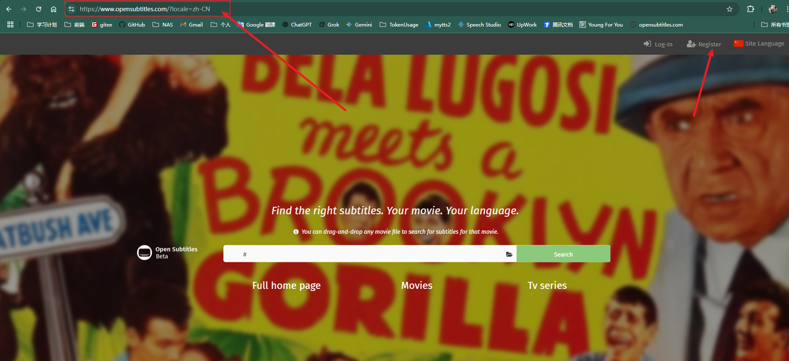
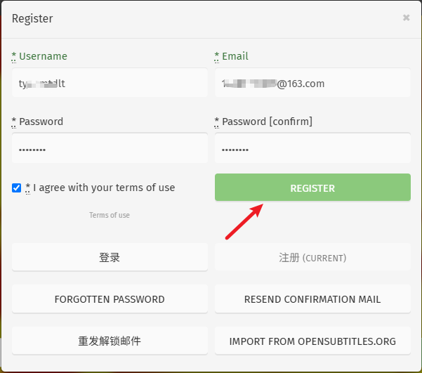
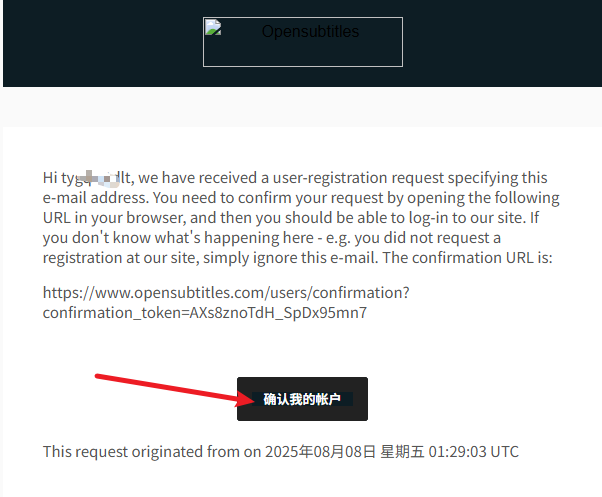
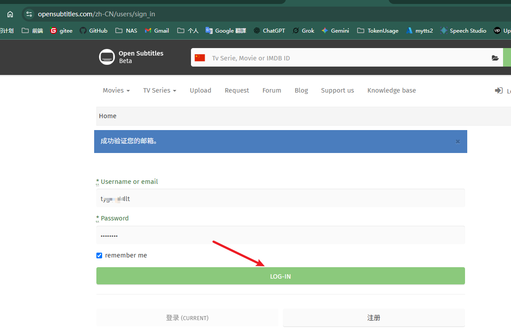
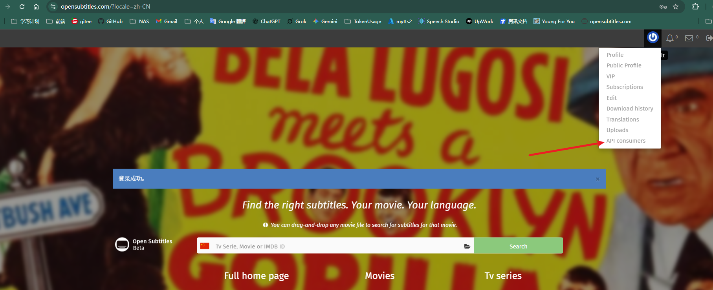
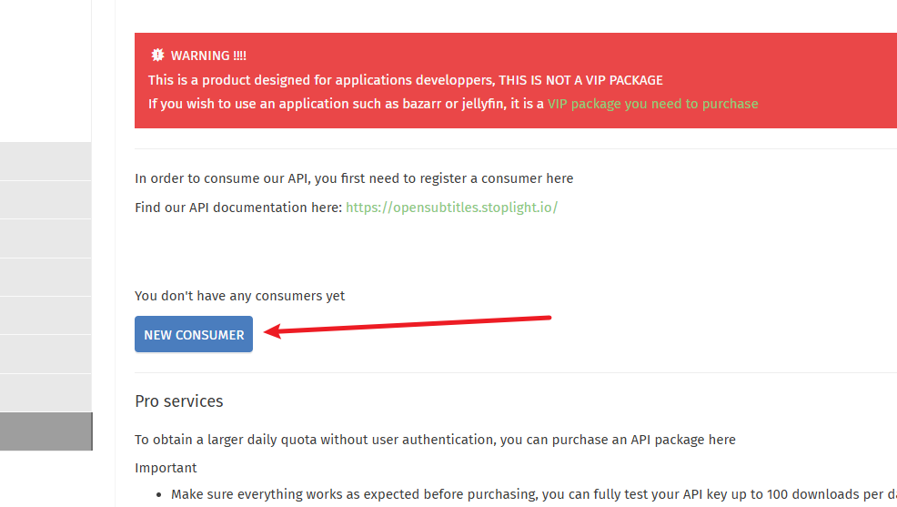
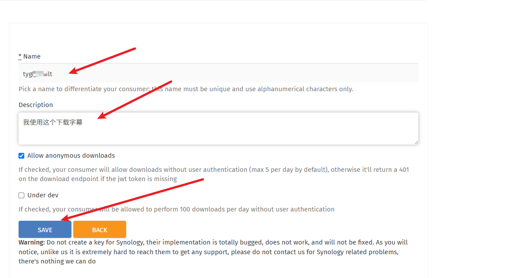
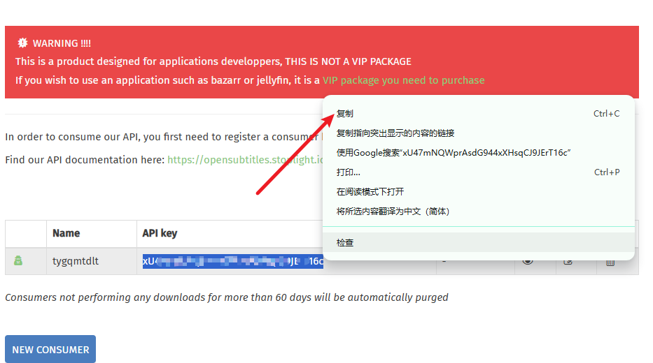

# 📝 获取 OpenSubtitle API Key 指南

> 本指南将帮助您快速获取 OpenSubtitle 的 API Key，用于电影学英语工具中的字幕下载功能。

## 🎯 概述

OpenSubtitle 是一个提供多语言字幕的开放平台，通过 API Key 可以访问其丰富的字幕资源。

---

## 📋 获取步骤

### 步骤 1: 注册账户

1. 打开 [OpenSubtitles 官网](https://www.opensubtitles.com/?locale=zh-CN)
2. 点击 **Register** 按钮进行注册

### 步骤 2: 填写注册信息

填写完整的注册信息，然后点击 **Register** 完成注册

### 步骤 3: 邮箱验证

1. 检查您的邮箱收件箱
2. 找到来自 OpenSubtitles 的确认邮件
3. 点击 **确认我的账户** 链接

### 步骤 4: 登录账户

使用刚才注册的账户信息进行登录

### 步骤 5: 访问 API 管理页面

登录成功后，在用户菜单中找到并点击 **API consumers**

### 步骤 6: 创建新的 API Consumer

点击 **NEW CONSUMER** 按钮创建新的 API 消费者

### 步骤 7: 填写应用信息

填写您的应用信息：
- **Name**: 应用名称（如：Movie Learning Tool）
- **Description**: 应用描述

填写完成后点击 **Save** 保存

### 步骤 8: 获取 API Key

🎉 **恭喜！** API Key 创建成功！

1. 选中并复制显示的 API Key
2. 将 API Key 粘贴到您的电影学英语工具中
3. 保存配置即可开始使用

---

## 🔧 使用说明

- ✅ 请妥善保管您的 API Key，不要泄露给他人
- ✅ API Key 有使用限制，请合理使用
- ✅ 如需更换 API Key，可重复以上步骤创建新的 Consumer

## 📞 技术支持

如果在获取过程中遇到问题，请检查：
- 网络连接是否正常
- 邮箱是否正确且能正常接收邮件
- 注册信息是否完整

---

*最后更新时间：2025年8月*
