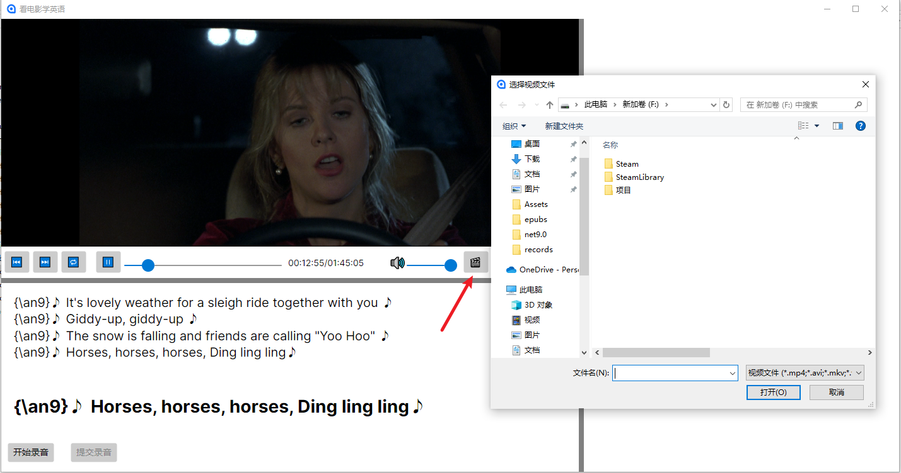
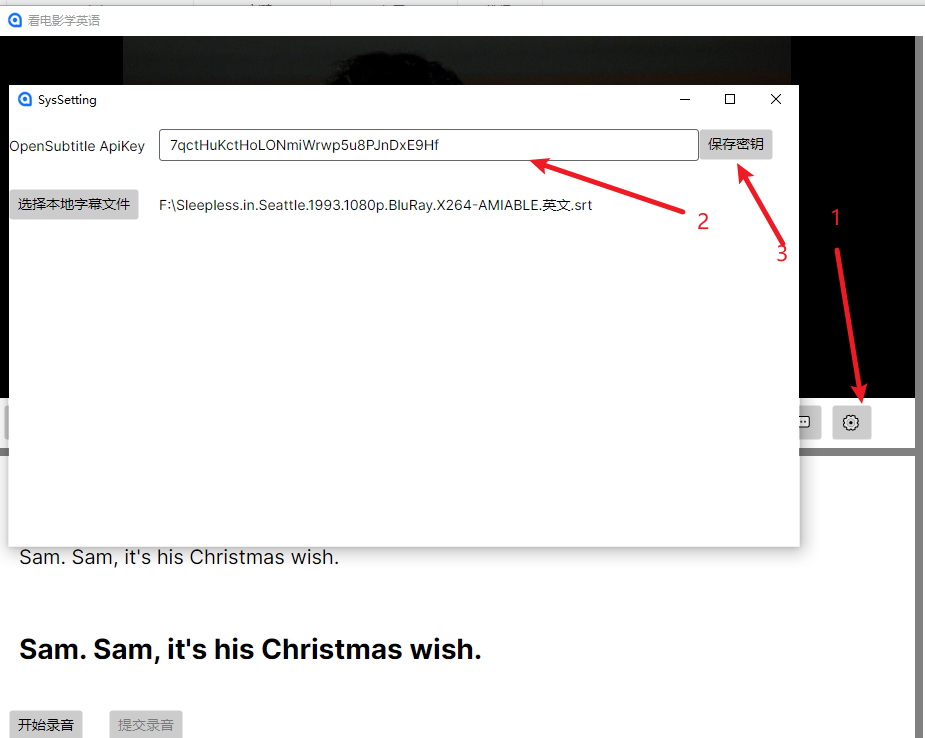
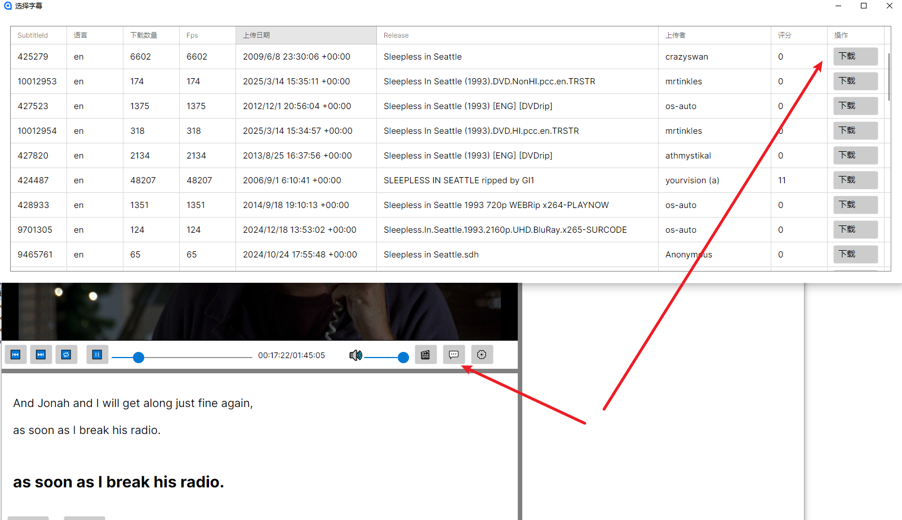
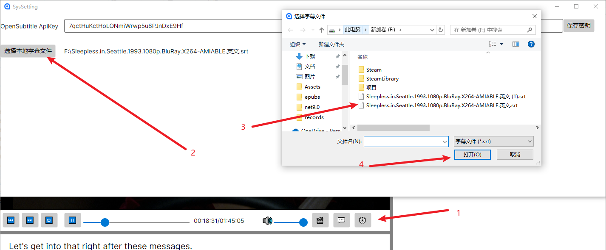

# 📖 QmtdltTools 使用手册

> 让电影成为你的英语老师，轻松愉快地学习英语！

## 🎯 快速开始

### 1️⃣ 用户注册

🌐 **访问官网：** https://youngforyou.top/

1. 点击页面右上角的 **Login** 按钮
2. 在登录页面点击 **"注册新账号"**
3. 填写注册信息完成账号创建

---

## 🎬 看电影学英语功能

### 2️⃣ 应用登录

> ⚠️ **注意：** 使用与网页端相同的用户名和密码进行登录

1. 打开 QmtdltTools 应用
2. 输入您在官网注册的账号信息
3. 点击登录按钮

### 3️⃣ 打开本地电影

📁 点击应用中的 **"打开本地电影"** 按钮，选择您想要观看的电影文件

### 4️⃣ 获取字幕 API Key

> 💡 **建议：** 为了获得最佳体验，建议您注册自己的 OpenSubtitles API Key

#### 📋 注册步骤：
详细注册步骤请参考文档：**"OpenSubtitleKey.pdf"**

#### 🔑 配置 API Key：
1. 完成 OpenSubtitles 注册后，获取您的 API Key
2. 在应用中找到 API Key 配置区域
3. 将您的 API Key 粘贴到输入框中
4. 点击 **"保存密钥"** 按钮

---

## 📝 字幕加载方式

### 方式一：在线字幕下载 🌐

1. 点击 **字幕下载图标** （如下图所示）
2. 等待字幕列表加载完成
3. 从列表中选择合适的字幕
4. 点击下载按钮

### 方式二：加载本地字幕 📂

如果您已经拥有对应电影的字幕文件：

1. 点击 **"使用本地字幕"** 按钮
2. 浏览并选择本地字幕文件
3. 确认加载

---

## ⚠️ 重要提示

> 🔄 **重启应用：** 无论选择哪种字幕加载方式，完成后都需要重启软件才能正常显示字幕

### 重启步骤：
1. 完全关闭 QmtdltTools 应用
2. 重新启动应用
---

## 🎉 开始学习

现在您已经完成了所有配置，可以开始使用 QmtdltTools 看电影学英语了！

### 学习建议：
- 📚 遇到不懂的单词可以暂停查询
- 📝 记录重要的语法和表达
- 🔄 重复观看精彩片段加深理解
- 🗣️ 模仿角色对话练习口语，进行发音评价

---

## ❓ 需要帮助？

如有任何问题，欢迎在B站私信或评论留言！

---

*最后更新时间：2024年*